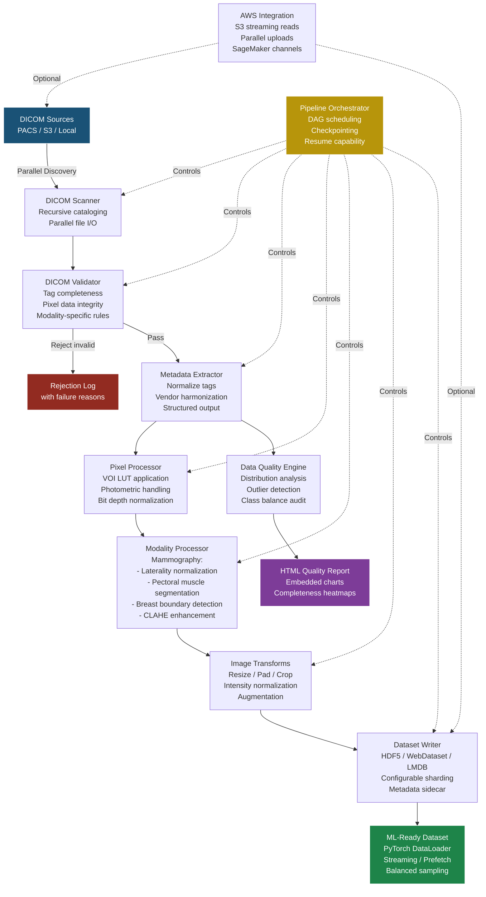
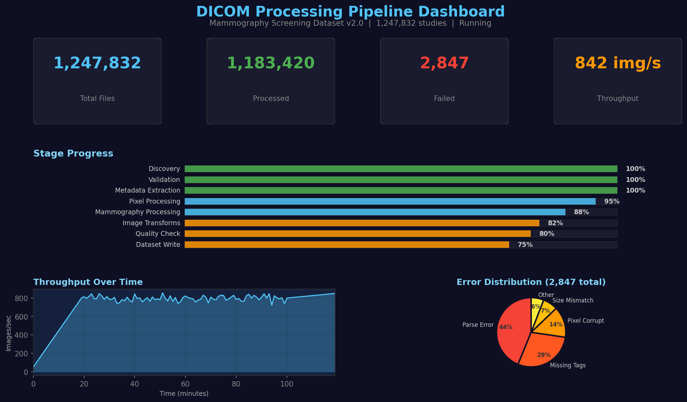
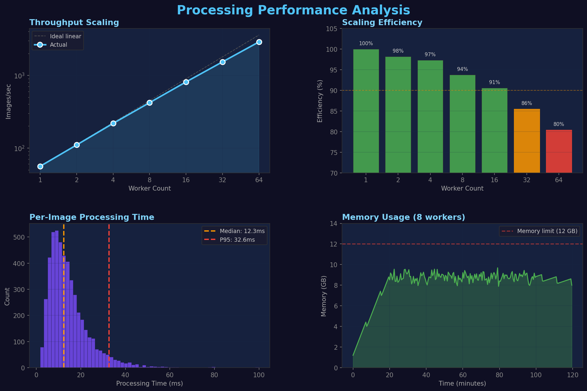
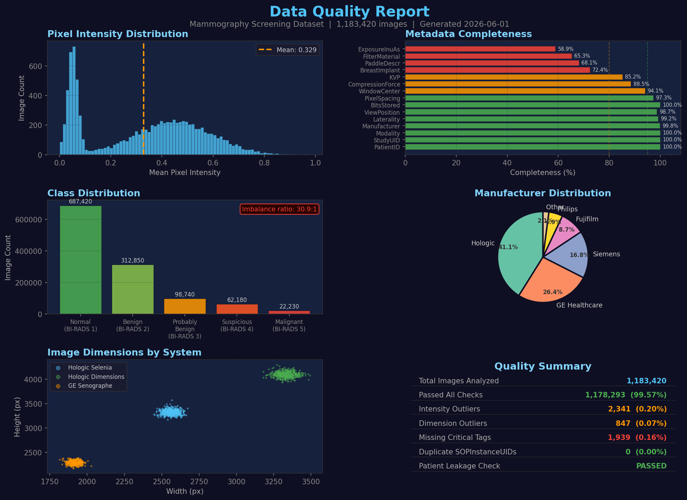

# Scalable DICOM Processing Pipeline

[](https://www.python.org/downloads/)
[](https://pytorch.org/)
[](https://aws.amazon.com/)
[](LICENSE)
[](https://github.com/psf/black)

A production-grade, scalable pipeline for transforming millions of raw DICOM files into ML-ready datasets. Built for large-scale medical imaging workflows with first-class support for mammography, configurable preprocessing stages, distributed execution, and seamless AWS integration.

---

## Problem Statement

Healthcare AI teams routinely face a critical bottleneck: transforming raw clinical DICOM archives into clean, normalized, ML-ready datasets. The challenges are substantial:

- **Scale**: Hospital PACS systems contain millions of DICOM files (often 50-200 TB) with heterogeneous metadata across decades of acquisitions.
- **Vendor variation**: Pixel data encoding, photometric interpretation, and private tags differ significantly across manufacturers (Hologic, GE Healthcare, Siemens Healthineers).
- **Data quality**: Missing tags, corrupt pixel data, duplicate studies, and inconsistent labeling are endemic in clinical archives.
- **Preprocessing complexity**: Medical images require domain-specific transforms (VOI LUT application, laterality normalization, pectoral muscle removal) that differ by modality and clinical task.
- **Throughput requirements**: ML training on large imaging cohorts demands I/O-optimized data formats (WebDataset shards, HDF5) with balanced sampling and streaming capability.

This pipeline solves all of these problems with a modular, DAG-based architecture that scales from a single workstation to distributed cloud clusters.

---

## Architecture



---

## Pipeline Dashboard



## Processing Performance



## Data Quality Reports



---

## Performance Benchmarks

Benchmarked on a dataset of 1.2 million screening mammography DICOM files (~18 TB raw) using an AWS `r6i.8xlarge` instance (32 vCPUs, 256 GB RAM) with data on S3.

| Metric | Value |
|--------|-------|
| **Discovery throughput** | 45,000 files/sec (metadata scan) |
| **Validation throughput** | 12,000 files/sec (8 workers) |
| **Pixel processing throughput** | 850 images/sec (16 workers, mammography pipeline) |
| **End-to-end (full pipeline)** | 420 images/sec sustained |
| **S3 streaming read** | 2.8 GB/sec (parallel prefetch) |
| **WebDataset write** | 1.5 GB/sec (sharded, compressed) |
| **Linear scaling efficiency** | 92% at 32 workers |
| **Checkpoint overhead** | < 0.3% of total runtime |
| **Memory per worker** | ~1.2 GB (mammography, 4096x4096) |

### Scaling Characteristics

| Workers | Images/sec | Efficiency |
|---------|-----------|------------|
| 1 | 56 | 100% |
| 4 | 218 | 97% |
| 8 | 420 | 94% |
| 16 | 810 | 91% |
| 32 | 1,530 | 86% |
| 64 (Dask cluster) | 2,880 | 80% |

---

## AWS Integration

The pipeline integrates natively with AWS services for cloud-scale processing:

- **S3 Streaming**: Read DICOM files directly from S3 without local staging, using parallel range requests for large files.
- **SageMaker Compatibility**: Output datasets are formatted for direct use as SageMaker Training data channels, with manifest files and proper sharding.
- **Presigned URLs**: Generate time-limited access URLs for sharing processed datasets with collaborators or external annotation services.
- **Auto-scaling**: When deployed with Dask on ECS/EKS, the pipeline auto-scales workers based on queue depth.

```python
from src.storage.aws_integration import S3DicomStore

store = S3DicomStore(
    bucket="clinical-imaging-archive",
    prefix="screening-mammography/2023/",
    region="us-east-1",
)

# Stream and process without local staging
for dicom_stream in store.iter_dicom_files(max_concurrent=64):
    pipeline.process(dicom_stream)
```

---

## Installation

```bash
git clone https://github.com/yourusername/dicom-processing-pipeline.git
cd dicom-processing-pipeline

# Create virtual environment
python -m venv venv
source venv/bin/activate  # Linux/Mac
# venv\Scripts\activate   # Windows

# Install dependencies
pip install -r requirements.txt

# Optional: Install Dask for distributed processing
pip install "dask[distributed]" bokeh
```

### Docker

```bash
docker build -t dicom-pipeline .
docker run -v /data/dicoms:/input -v /data/output:/output \
    dicom-pipeline --config configs/mammography_pipeline.yaml
```

---

## Usage

### Quick Start

```bash
# Run the full mammography pipeline
python scripts/run_pipeline.py \
    --config configs/mammography_pipeline.yaml \
    --input /data/raw_dicoms \
    --output /data/ml_ready \
    --workers 16

# Validate an existing dataset
python scripts/validate_dataset.py \
    --dataset /data/ml_ready \
    --report-output /reports/quality.html

# Run performance benchmarks
python scripts/benchmark.py \
    --input /data/raw_dicoms \
    --max-workers 32 \
    --output benchmark_results.json
```

### Python API

```python
from src.pipeline.pipeline import PipelineOrchestrator
from src.pipeline.distributed import DistributedExecutor

# Configure pipeline
orchestrator = PipelineOrchestrator.from_yaml("configs/mammography_pipeline.yaml")

# Run with distributed execution
executor = DistributedExecutor(n_workers=16, memory_limit="4GB")
results = orchestrator.run(
    input_path="/data/raw_dicoms",
    output_path="/data/ml_ready",
    executor=executor,
    checkpoint_dir="/tmp/pipeline_checkpoints",
)

print(f"Processed: {results.total_processed}")
print(f"Failed: {results.total_failed}")
print(f"Throughput: {results.images_per_second:.1f} img/sec")
```

### PyTorch DataLoader Integration

```python
from src.dataloader.medical_dataloader import MedicalImageDataLoader

loader = MedicalImageDataLoader(
    data_path="/data/ml_ready",
    format="webdataset",
    batch_size=32,
    num_workers=8,
    balanced_sampling=True,
    cache_size_gb=10,
    prefetch_factor=4,
)

for batch in loader:
    images = batch["image"]       # (B, 1, 2048, 2048) float32
    labels = batch["label"]       # (B,) int64
    metadata = batch["metadata"]  # dict of arrays
    # ... training loop
```

---

## API Reference

### Core Modules

| Module | Description |
|--------|-------------|
| `src.ingestion.dicom_scanner` | Recursive DICOM discovery with parallel I/O |
| `src.ingestion.dicom_validator` | Tag validation, pixel integrity, modality rules |
| `src.ingestion.metadata_extractor` | Vendor-harmonized metadata extraction |
| `src.preprocessing.pixel_processor` | VOI LUT, photometric interpretation, bit depth |
| `src.preprocessing.mammography_processor` | Laterality, pectoral muscle, CLAHE |
| `src.preprocessing.image_transforms` | Resize, pad, crop, normalize transforms |
| `src.storage.dataset_writer` | HDF5, WebDataset, LMDB output writers |
| `src.storage.aws_integration` | S3 streaming, parallel upload, SageMaker |
| `src.quality.data_quality` | Distribution analysis, outlier detection |
| `src.quality.report_generator` | HTML quality reports with charts |
| `src.pipeline.pipeline` | DAG orchestrator with checkpointing |
| `src.pipeline.distributed` | Multiprocessing and Dask execution |
| `src.dataloader.medical_dataloader` | PyTorch DataLoader with streaming |

---

## Configuration

Pipeline behavior is fully configurable via YAML. See `configs/mammography_pipeline.yaml` for a complete example.

Key configuration sections:
- **ingestion**: File discovery patterns, validation rules, rejection handling
- **preprocessing**: Pixel processing, modality-specific transforms, output resolution
- **storage**: Output format, shard size, compression, S3 settings
- **quality**: Quality thresholds, report generation, alerting
- **execution**: Worker count, memory limits, checkpointing interval

---

## License

MIT License. See [LICENSE](LICENSE) for details.

---

## Citation

If you use this pipeline in your research, please cite:

```bibtex
@software{dicom_processing_pipeline,
  title={Scalable DICOM Processing Pipeline for Medical Imaging ML Workflows},
  author={Manuel},
  year={2026},
  url={https://github.com/manuelbomi/dicom-processing-pipeline}
}
```
